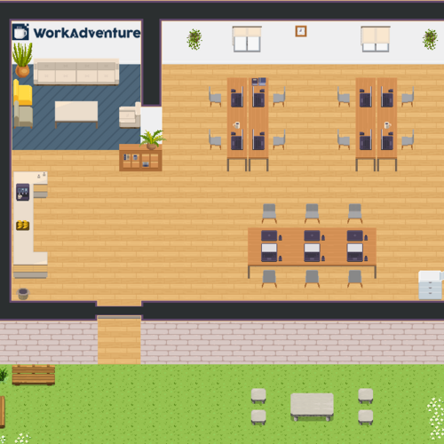

# WorkAdventure Map Starter Kit



This is a starter kit to help you build your own map for [WorkAdventure](https://workadventu.re).

To understand how to use this starter kit, follow the tutorial at [https://workadventu.re/map-building](https://workadventu.re/map-building).

## Structure
* **assets** : All tilesets
* **src** : All TypeScript/Javascript scripts
* **map.json** : Map file
* **map.png** : Image displayed on README.md and on the map infos in-game

If you want to use more than one map file, just add the new map file in the root folder, your tilesets in the assets folder and a new script if you need it in the src folder (it will be automaticaly optimized in production).

## Installation

With npm installed (comes with [node](https://nodejs.org/en/)), run the following command into a terminal in the two directories api-score/ and WA/ :

```shell
npm install
```

## Run project

Go into the api-score/ directory.  
Copy the .env.dist file into .env.

And with [docker](https://docs.docker.com/get-docker/) and [docker-compose](https://docs.docker.com/compose/install/) installed, run :
```shell
docker-compose up -d
```

Then go into the WA/ directory, and run :
```shell
npm run dev
```

After that, a tab in your web browser will open on the Work Adventure interface

## Test optimized map
You can test the optimized map as you do in production:
```sh
npm run build
npm run preview
```

## Licenses

This project contains multiple licenses as follows:

* [Code license](./LICENSE.code) *(all files except those for other licenses)*
* [Map license](./LICENSE.map) *(`map.json` and the map visual as well)*
* [Assets license](./LICENSE.assets) *(the files inside the `src/assets/` folder)*

### About third party assets

If you add third party assets in your map, do not forget to:
1. Credit the author and license with the "tilesetCopyright" property present in the properties of each tilesets in the `map.json` file
2. Add the license text in LICENSE.assets
